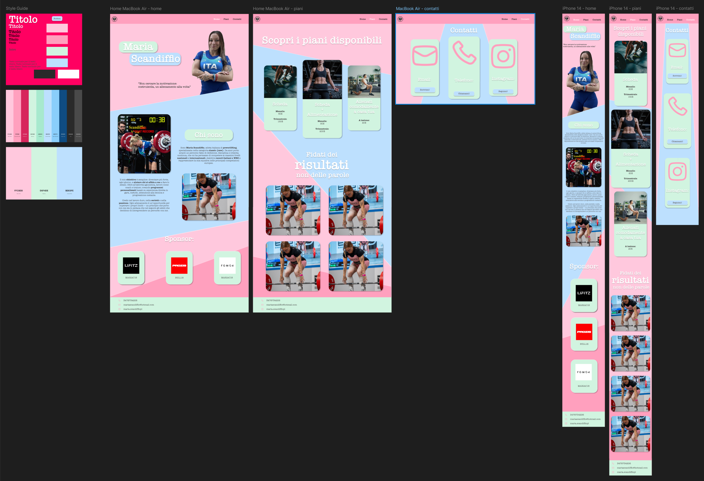

# 🌐 Official Website of Maria Scandiffio  
### Italian Powerlifting Athlete & Personal Trainer

---

## 🎯 Project Purpose
The goal of this project is to build the official website for **Maria Scandiffio**, an Italian powerlifting athlete, showcasing:

- Available **training programs**  
- Real **client results**  
- Direct **contact options** for coaching  
- A **modern and responsive** visual style made with pure CSS  

---

## ✨ Main Features

### 🎨 Modern Design
- Soft pastel color palette (pink, blue, green)  
- Dynamic geometric shapes using `clip-path`  
- Smooth transitions and interactive effects  

### 📱 Responsive First
- Fluid layouts with **CSS Grid** and **Flexbox**  
- Optimized breakpoints for mobile, tablet, and desktop  
- Scalable typography using `clamp()`  

### 🧩 Key UI Components
- **Animated header**  
- **Contact cards**  
- **Training plan cards**  
- **Results gallery**  
- **Dynamic geometric background**  

---

## 🎨 Design

---

## 👨‍💻 Technologies Used
- **HTML5**  
- **CSS3**  
- **Flexbox & Grid Layout**  
- **No JavaScript** (full-CSS design)  

---

## 📝 Author
Project developed by **Gianni Navolio**.

# 🌐 Sito Web Ufficiale di Maria Scandiffio  
### Atleta italiana di Powerlifting & Personal Trainer

---

## 🎯 Obiettivo del progetto
Realizzare il sito ufficiale di **Maria Scandiffio**, atleta italiana di powerlifting, con lo scopo di presentare:

- I **piani di allenamento** disponibili  
- I **risultati reali** ottenuti dai clienti  
- I **contatti diretti** per collaborazioni o coaching  
- Uno **stile grafico moderno** e completamente responsive, realizzato in **CSS puro**

---

## ✨ Caratteristiche principali

### 🎨 Design moderno
- Palette colori pastello (rosa, blu, verde)  
- Forme geometriche dinamiche tramite `clip-path`  
- Animazioni fluide ed effetti di transizione  

### 📱 Responsive First
- Layout fluidi con **CSS Grid** e **Flexbox**  
- Breakpoint ottimizzati per mobile, tablet e desktop  
- Tipografia scalabile con `clamp()`  

### 🧩 Componenti UI principali
- **Header animato**  
- **Cards contatti**  
- **Cards dei piani di allenamento**  
- **Galleria dei risultati**  
- **Background geometrico dinamico**  

---

## 🎨 Design

---

## 👨‍💻 Tecnologie utilizzate
- **HTML5**  
- **CSS3**  
- **Flexbox & Grid Layout**  
- **Nessun JavaScript** (design full-CSS)  

---

## 📝 Autore
Progetto sviluppato da **Gianni Navolio**.

